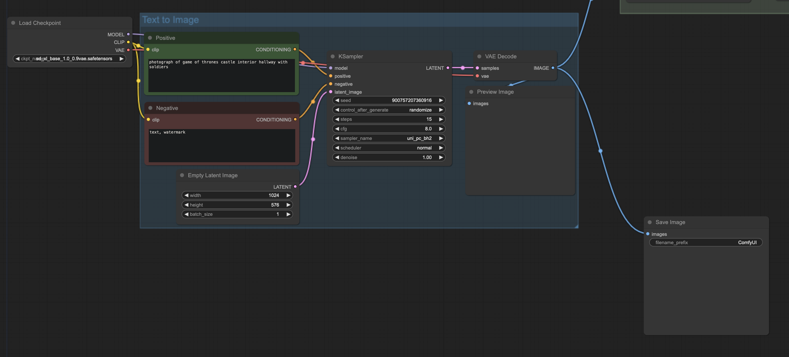
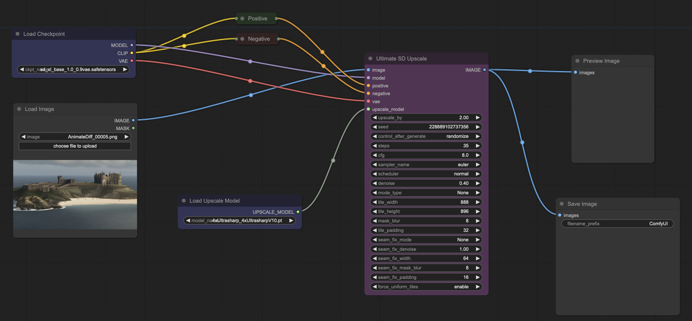

## Overview
This project showcases the creative process of generating multimedia content using a combination of state-of-the-art AI models. The workflow involves the use of Stable Diffusion XL for image generation, subsequent resizing as needed, integration of Stable Diffusion for video animation, and finally, Suno AI for music generation.

## Workflow

1. Image Generation with Stable Diffusion XL\
The initial step involves utilizing the Stable Diffusion XL model to generate high-quality images.

2. Image Resizing\
Images generated by Stable Diffusion XL may need resizing or downscaling for specific requirements.

3. Video Animation with Stable Diffusion Video\
To create dynamic content, Stable Diffusion Video is employed for video animation.

4. Music Generation\
Suno AI is utilized to generate captivating music that complements the visual content.
